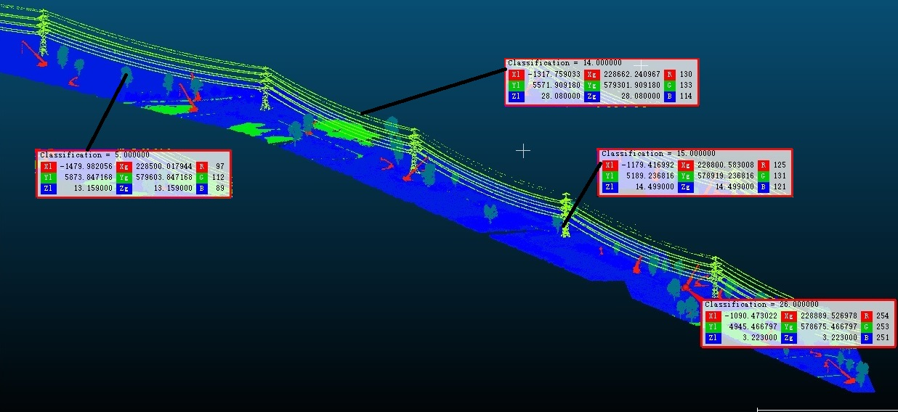

# AHN transmission corridor
Synthetic point clouds dataset for powerline protection research.

## data type
- ground
- high tree/vegetation(5)
- powerline(14)
- transmission tower/pylon(15)
- crane(26)(customized)

## features
- Crop a transmission corridor from AHN4 dataset
- Along the powerline from Kloosterveen to Hoogkerk
- The corridor width is 40m
- Ground and powerline(14) are derived from the original dataset
- The high trees/vegetation(5) are deformed and moved under the powerline
- The cranes are classified as 26 and copied under powerline
- The transmission tower/pylon would be classified as 15.
- Transform the original flat terrain to the hilly. (In process)

